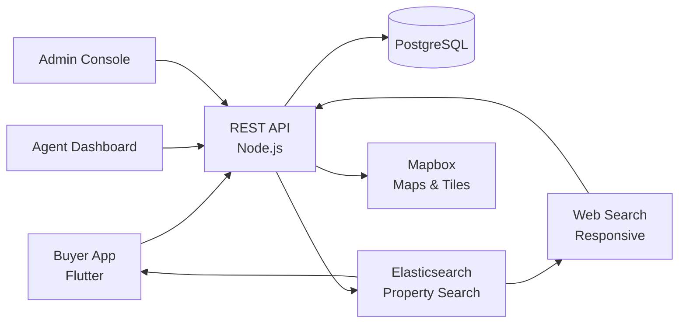

# Zillow Clone — White-Label Real Estate Marketplace Platform by Miracuves

**MXEstate** is a production-ready, white-label Zillow clone: a complete real estate marketplace with buyer, agent, and admin panels — delivered with **100% source code ownership** in **6 working days**.

> 🏘️ **See it running before you talk to anyone.** Live buyer app, agent dashboard, and admin console — demo credentials are printed on the [solution page](https://miracuves.com/zillow-clone#demo). No sales call required.

---

## 🚀 Live Demos

| Environment | URL | What you can test |
|---|---|---|
| 📱 Buyer App | [mas.mimeld.com](https://mas.mimeld.com) | Search listings, save, schedule tours, mortgage |
| 🌐 Web Search | [mxestate.mimeld.com](https://mxestate.mimeld.com) | Map search, filters, listings, schools, commute |
| 🏡 Agent Dashboard | [Solution page → Demo](https://miracuves.com/zillow-clone#demo) | Listings, leads, CRM, calendar, analytics |
| 🛠️ Admin Console | [Solution page → Demo](https://miracuves.com/zillow-clone#demo) | Agents, listings, lead routing, analytics |

Demo credentials for all environments: **[miracuves.com/zillow-clone → Demo section](https://miracuves.com/zillow-clone/#demo)**

---

## ✨ What Makes This Zillow Clone Different

Most real estate scripts stop at "list + view." This platform ships with the features that actually run a property *business*:

- **Map-First Search** — polygon-draw, school districts, commute-time filters — same map-search UX Zillow and Redfin built
- **Lead Routing Engine** — 
- **3D Tour Embedding** — zip-code-based, round-robin, performance-weighted agent routing — same lead-routing engine Realtor.com and Zillow use
- **Mortgage Pre-Qualification** — supports listings across regions with locale-aware price, currency, and measurement units
- **Multi-Country Property Data** — integrated lenders and pre-qualification flows — what converts visits into contracts

## 📦 Core Features

**Buyer / Renter:** map-based search · advanced filters · saved searches · school & commute data · schedule tours · mortgage calculator · favorites · agent messaging

**Agent:** lead inbox · CRM pipeline · listing wizard · tour scheduler · buyer match · performance analytics · payouts

**Admin:** agent verification · lead routing · listing moderation · ad placement · analytics reports

## 🏗️ Architecture

**Stack:** Flutter mobile apps (Android + iOS) · Node.js backend · PostgreSQL + Elasticsearch for property search · Stripe Connect for agent payouts · Mapbox for maps · Stripe Connect, regional gateways, multi-currency

## 📋 What’s Included

- ✅ Full source code — backend, web, mobile apps, panels (no encryption, no license locks)
- ✅ Deployment to your servers & app store submission assistance
- ✅ Your branding — white-label rename, logo, colors, domain
- ✅ 60 days post-launch support + 12 months of free updates
- ✅ Documentation & handover

**Pricing:** from **$2,899**, transparent on the [solution page](https://miracuves.com/zillow-clone/#pricing) — no "contact us for quote" games.

## 🆚 Why Not Build From Scratch?

Custom real estate platforms run $80k–$350k and 5–10 months. A proven white-label base gets you to market in 6 working days for a fraction of that, with your budget preserved for agent onboarding and demand-side marketing.

## 📚 Resources

- 📖 [Zillow Clone — Full Solution Page](https://miracuves.com/zillow-clone) (features, pricing, demos, FAQ)
- 💰 [How Much Does a Real Estate App Cost in 2026?](https://miracuves.com/zillow-clone#pricing) pricing breakdown & what's included
- 📝 [Best Zillow Clone Script in 2026](https://miracuves.com/zillow-clone/blog/) features, pricing & launch guide
- 🧠 [Map-First Search: Why Polygon-Draw Wins for Property](https://miracuves.com/zillow-clone/blog/) lessons from Zillow & Redfin
- ✅ [Miracuves Facts & Claims Ledger](https://miracuves.com/zillow-clone/facts/) every claim we make, verified

## 🏢 About Miracuves

[Miracuves Solutions](https://miracuves.com) builds white-label clone apps and custom software from Mumbai, India — 90+ ready-made solutions, live demos for every product, transparent pricing, and delivery in 6 working days. Operating since 2010.

**Talk to us:** [WhatsApp](https://wa.me/919830009649) · [Schedule a consultation](https://miracuves.com/schedule-consultation/) · [miracuves.com](https://miracuves.com)

---

### ⚠️ Note on This Repository

This repository is a product overview. The full source code is delivered to clients on purchase — see [what’s included](https://miracuves.com/zillow-clone/#included). For a hands-on evaluation, use the live demos above; credentials are public on the solution page.

*Keywords: zillow clone, zillow clone script, real estate, property marketplace, white label Zillow, agent CRM, Flutter real estate app, Node.js property*

---

<!--
══════════════════════════════════════════════════
TEMPLATE VARIABLE KEY — auto-generated from Netflix-Clone pattern
══════════════════════════════════════════════════
{APP_NAME}        Zillow Clone
{MX_NAME}         MXEstate
{CATEGORY}        Real Estate Marketplace Platform
{DEMO_WEB}        mxestate.mimeld.com
{PRICE}           $2,899
{SLUG}            zillow-clone
{SOLUTION_URL}    https://miracuves.com/zillow-clone/
{VERTICAL}        real_estate

See /tmp/verticals/real_estate.txt for the vertical config used to generate this README.
══════════════════════════════════════════════════
-->